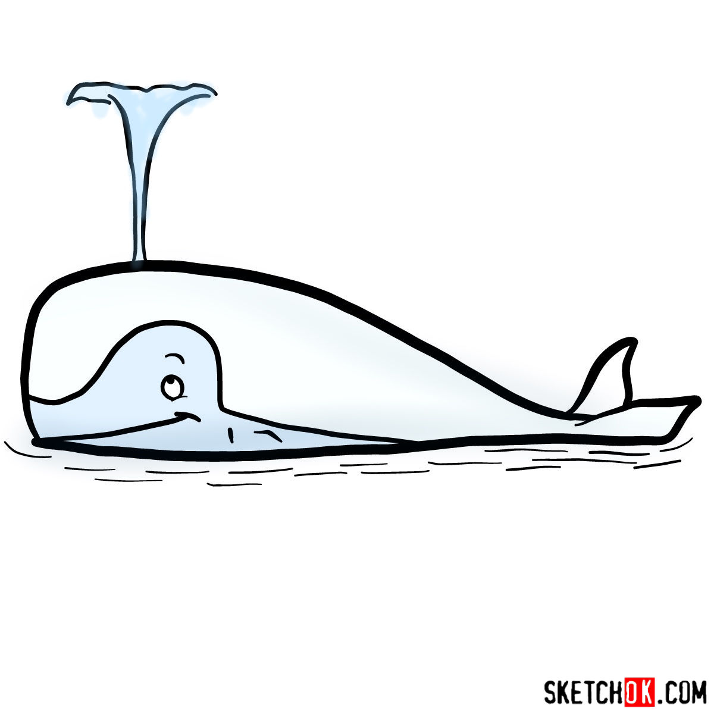
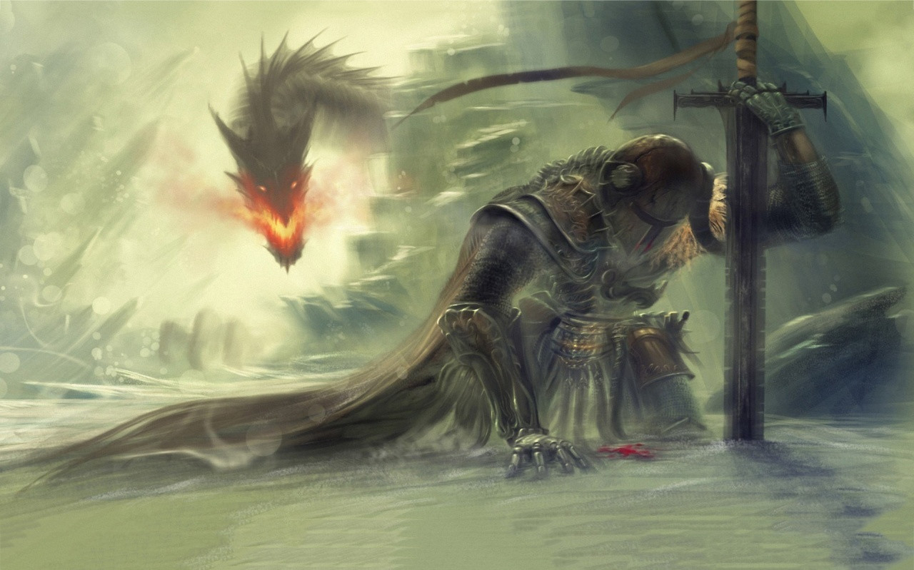

<!--StartFragment-->

# Call me Ishmael.

Some years ago—never mind how long precisely—having little or no money in my purse, and nothing particular to interest me on shore, I thought I would sail about a little and see the watery part of the world. It is a way I have of driving off the spleen and regulating the circulation. Whenever I find myself growing grim about the mouth; whenever it is a damp, drizzly November in my soul; whenever I find myself involuntarily pausing before coffin warehouses, and bringing up the rear of every funeral I meet; and especially whenever my hypos get such an upper hand of me, that it requires a strong moral principle to prevent me from deliberately stepping into the street, and methodically knocking people’s hats off—then, I account it high time to get to sea as soon as I can. This is my substitute for pistol and ball. With a philosophical flourish Cato throws himself upon his sword; I quietly take to the ship. There is nothing surprising in this. If they but knew it, almost all men in their degree, some time or other, cherish very nearly the same feelings towards the ocean with me.

## There now is your insular city of the Manhattoes, belted round by wharves as Indian isles by coral reefs—commerce surrounds it with her surf. Right and left, the streets take you waterward. Its extreme downtown is the battery, where that noble mole is washed by waves, and cooled by breezes, which a few hours previous were out of sight of land. Look at the crowds of water-gazers there.

### Circumambulate the city of a dreamy Sabbath afternoon. Go from Corlears Hook to Coenties Slip, and from thence, by Whitehall, northward. What do you see?—Posted like silent sentinels all around the town, stand thousands upon thousands of mortal men fixed in ocean reveries. Some leaning against the spiles; some seated upon the pier-heads; some looking over the bulwarks of ships from China; some high aloft in the rigging, as if striving to get a still better seaward peep. But these are all landsmen; of week days pent up in lath and plaster—tied to counters, nailed to benches, clinched to desks. How then is this? Are the green fields gone? What do they here?

<!--EndFragment-->